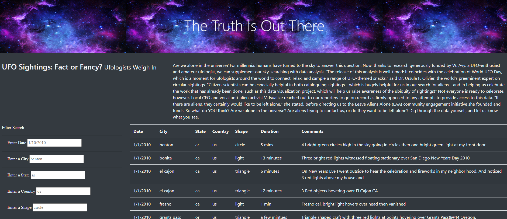
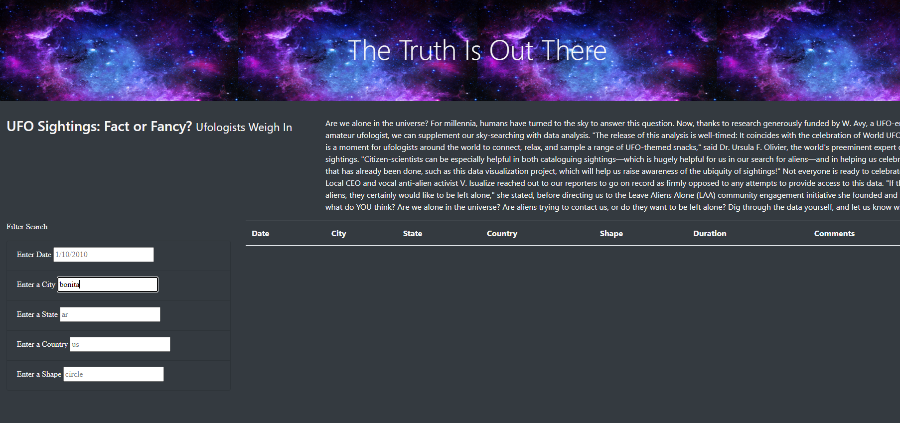

# Analysis of UFO sightings

## Overview:

A dynamic webpage that allow for user interaction is created. Users are able to filter for multiple criterias including date, city, state, country, and shape at the same time.

## Result:

#### step 1: Open the website.
 /n
#### step 2: enter the full name of the criteria in the appropriate filter search box. Ex. enter "bonita" in city box. *Full name must be used.
 /n
#### step 3: press enter and the object that match the criteria will show up.

## Summary:
### Drawback:
User has to enter the full name of the criteria in order to match the data.
### Recommendations for further development:
1. Add "toLowerCase()" to the input value so even if the users enter uppercase letter, code will convert it to lowercase to match our data.js file which is all in lowercase letters.
2. To make the search process more reactive, we can make the seach box to filter out the data that doesn't match the input letter/number as the user is typing. In this case, we will add another if statment that includes ".style.display = 'none' ".

